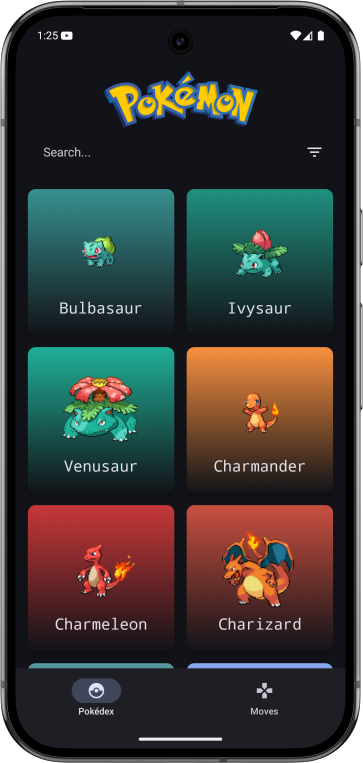
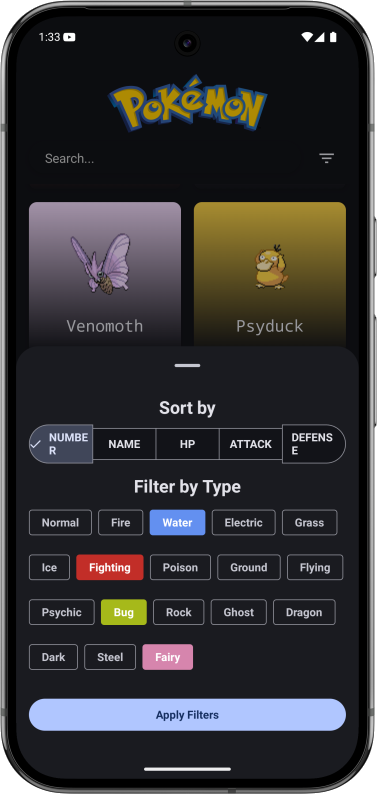

## Тестовое задание "Покемоны"

## Основной функционал
* Поиск и фильтрация покемонов
* Работа без интернета (кеширование)

Приложение использует API "PokeAPI":

https://pokeapi.co/docs/v2

## Основные требования
* Приложение должно поддерживать кеширование и иметь возможность работать без интернета
* Весь функционал по поиску и фильтрации также должен поддерживать работу без интернета
* Приложение должно поддерживать навигацию назад. На всех экранах, кроме главного, необходимо отображать стрелку назад
* Если после выполнения запроса данных не оказалось, то необходимо показывать соответствующий текст пользователю (возможно при поиске или фильтрации)
* Необходимо поддерживать Pull-to-Refresh
* В момент загрузки данных необходимо отображать прогресс-индикатор

## Основной экран

После запуска приложения, первым должен отображаться экран с покемонами.

Список необходимо выполнить в виде таблицы с 2 столбцами.

Каждый элемент списка должен содержать:
* Название покемона (name)
* Картинку (image)

Данный список должен поддерживать пагинацию.

На экране должен быть доступ к поиску по данной вкладке, а также возможности отфильтровать.

### Пример экрана:

## Фильтры

Экран должен содержать опции для фильтрации, а также кнопку для применения фильтра

### Пример экрана:

## Детали покемона

Детальную информацию для покемона делать необязательно, но если добавите, то будет плюсом

